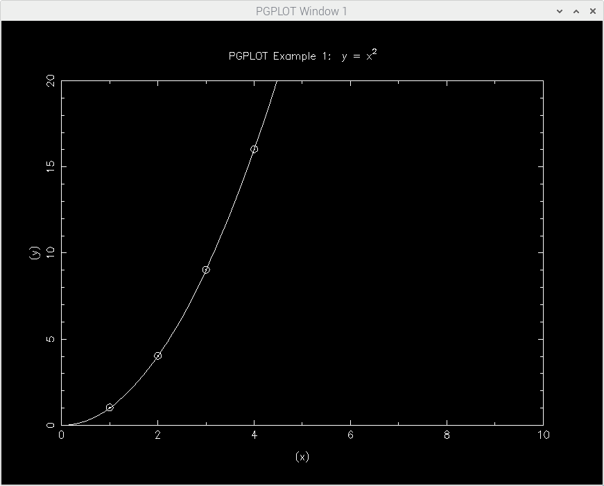

# STVID

**stvid** is a set of *python* programs to detect and identify satellite tracks on observations of the night sky, and measure the satellite positions to determine and/or update their orbits.

## Background
This software will take over the satellite tracking functionality of C.Bassa's [sattools](https://github.com/cbassa/sattools). By porting the functionality to *python*, and using [astropy](https://github.com/astropy/astropy), and [opencv](https://opencv-python-tutroals.readthedocs.io/en/latest/), the software is indented to be easier to install and operate.

This repository is currently used for development, and relies, for the moment, on programs from the [sattools](https://github.com/cbassa/sattools) repository (namely `satid`).

## Installation
**stvid** handles requirements using pip. You can install requirements by running :

`pip install -r requirements.txt`

Consider using a VirtualEnv to run stvid on a separate python virtual environment.

### Additional requirements
* [Hough3dLines](https://gitlab.com/pierros/hough3d-code)
  * `hough3dlines` needs to be executable in your path
* [Sextractor](https://github.com/astromatic/sextractor)
  * `sextractor` needs to be executable in your path
* [Astromentry.net](https://github.com/dstndstn/astrometry.net)
  * `solve-field` needs to be executable in your path, with index files appropriate for your FOV
* [ZWO ASI SDK](https://astronomy-imaging-camera.com/software-drivers) if using a ZWO camera
* [Picamerax](https://github.com/labthings/picamerax) if using a Raspberry Pi camera. It can be installed by running:
`sudo pip install "picamerax[array]"`

## Installation on a Raspberry Pi for Acquistion.

**stvid** can be run on a Raspberry Pi 4B 8Gb with the Raspberry HQ Camera. Installation is not as easy as a on regular Linux and this installation step only supports the filming using acquire.py. The processing can be done on a dektop PC or laptop which has the complete installations of **sattools** and **stvid**. This guide is not complete nor correct. If you try this, please let me know what needs to be improved! 

### Requirements

Make sure the camera is enabled and tested using raspistill. For more info see: 

[https://www.raspberrypi.com/documentation/accessories/camera.html#raspistill](https://www.raspberrypi.com/documentation/accessories/camera.html#raspistill)


Using the HQ camera under python is currently (December 2021) only supported on Buster and not on the newer Bullseye. Run:

`cat /etc/os-release`

Check that it says `buster`. If you are reading this in the future, you should check if your version of the OS supports the camera under python.

For installing we need the OS to be up to date:

```
sudo apt-get update --allow-releaseinfo-change
sudo apt-get upgrade
```

Also cmake and some build tools need to be installed:

```
sudo apt-get install cmake
sudo apt install build-essential
```

**stvid** runs in pyhton3, it is probably already installed, but if not:

`sudo apt install python3`

Next the installation of OpenCv is needed. This is based on [https://www.pyimagesearch.com/2018/09/19/pip-install-opencv/](https://www.pyimagesearch.com/2018/09/19/pip-install-opencv/)

Consider using a VirtualEnv to run stvid on a separate python virtual environment.

```
cd
sudo apt-get install libhdf5-dev libhdf5-serial-dev libhdf5-103
sudo apt-get install libqtgui4 libqtwebkit4 libqt4-test python3-pyqt5
sudo apt-get install libatlas-base-dev
sudo apt-get install libjasper-dev
wget https://bootstrap.pypa.io/get-pip.py
sudo python3 get-pip.py
sudo pip install opencv-contrib-python==4.1.0.25
```

This is a good moment to test OpenCV:

```
pi@allsky:~/stvid $ python3
Python 3.7.3 (default, Jan 22 2021, 20:04:44) 
[GCC 8.3.0] on linux
Type "help", "copyright", "credits" or "license" for more information.
>>> import cv2
>>> cv2.__version__
'4.1.0'
>>> quit()
pi@allsky:~/stvid $ 
```

Install support for the Rapberry Pi cam in python:

`sudo pip install "picamerax[array]"`


The requirements are handled using pip. You can install requirements by running :

```
pip install -r requirements-pi.txt

```

### STVID

Stvid can be installed from this repository:

```
cd
git clone https://github.com/EelkeVisser/stvid.git
cd stvid
cp configuration.ini-dist configuration.ini
```

## Installation on a Raspberry Pi for Processing.

The processing can also be done on the Raspberry Pi, using process.py. But it has some dependecies that have no packages for the Raspberry, and need to be installed from source. This makes it difficult to install. I have it working and tried to document it here. But this guide is not complete nor correct. If you try this, please let me know what needs to be improved! The process.py make use of pgplot, and pgplot is dependent on libpng, bit does not work with the current version it needs an older version of libpng. Another problem is that giza is installed as replacement of pgplot, but does not seem usable from a quick test.

First we need to uninstall giza. Find if you have pgplotclib installed:

`sudo find / -name libcpgplot.so`

If so then it is probably giza, that needs to be uninstalled:

`sudo apt-get purge giza-dev`

Check if it has been removed.

`sudo find / -name libcpgplot.so`

Next we need an older version of libpng. I used version 1.4. Download it from [https://sourceforge.net/projects/libpng/files/libpng14/1.4.22/libpng-1.4.22.tar.gz/download](https://sourceforge.net/projects/libpng/files/libpng14/1.4.22/libpng-1.4.22.tar.gz/download)

And compile and install libpng:

```
cd libpng-1.4.22/
sudo ./install-sh 
sudo ./configure
sudo make
sudo make install
```

### PGPLOT

Next is pgplot based on [https://sites.astro.caltech.edu/~tjp/pgplot/install-unix.html](https://sites.astro.caltech.edu/~tjp/pgplot/install-unix.html)

It needs a fortran compiler:

```
sudo apt-get install gfortran
```

Download the source from [ftp://ftp.astro.caltech.edu/pub/pgplot/pgplot5.2.tar.gz](ftp://ftp.astro.caltech.edu/pub/pgplot/pgplot5.2.tar.gz) as follows:

```
cd /usr/local
mkdir src
cd src
wget ftp://ftp.astro.caltech.edu/pub/pgplot/pgplot5.2.tar.gz
gunzip -c pgplot5.2.tar.gz | tar xvof -
```

Make the target directory, go there to generate the makefile:

```
mkdir /usr/local/pgplot
cd /usr/local/pgplot
```

Copy the drivers list file:

`sudo cp /usr/local/src/pgplot/drivers.list .`

And edit it to enable /XWINDOW and /PNG, by removing the ! Or use mine:

```
sudo mv drivers.list drivers.list.backup
sudo wget https://raw.githubusercontent.com/EelkeVisser/stvid/master/readme/drivers.list
```

Generate the makefile.

`sudo /usr/local/src/pgplot/makemake /usr/local/src/pgplot linux f77_gcc`

This should result in:

```
For additional information, read file /usr/local/src/pgplot/sys_linux/aaaread.me
Reading configuration file: /usr/local/src/pgplot/sys_linux/f77_gcc.conf
Selecting uncommented drivers from ./drivers.list
Found drivers NUDRIV PNDRIV XWDRIV
Copying color database.
Creating make file: makefile
Determining object file dependencies.
```

You should have the following files, when running `ls -l`:

```
total 128
-rw-r--r-- 1 root root  6577 Jan  7 21:02 drivers.list
-rw-r--r-- 1 root root  6577 Jan  7 21:01 drivers.list.backup
-rw-r--r-- 1 root root   750 Jan  7 21:02 grexec.f
-rw-r--r-- 1 root root  3911 Jan  7 21:02 grpckg1.inc
-rw-r--r-- 1 root root 40893 Jan  7 21:03 makefile
-rw-r--r-- 1 root root 40731 Jan  7 21:02 makefile.backup
-rw-r--r-- 1 root root  6287 Jan  7 21:02 pgplot.inc
-rw-r--r-- 1 root root 16059 Jan  7 21:02 rgb.txt

```

Now the makefile needs some editing. Or download mine:

```
sudo mv makefile makefile.backup
sudo wget https://raw.githubusercontent.com/EelkeVisser/stvid/master/readme/makefile
```

Remove -u at:

`FFLAGC=`

Change png to png14:

```
PGPLOT_LIB=-L`pwd` -lpgplot -lpng14 -lz
CPGPLOT_LIB=-L`pwd` -lcpgplot -lpgplot -lpng14 -lz

pndriv.o : /usr/local/include/libpng14/png.h /usr/local/include/libpng14/pngconf.h /usr/include/zlib.h /usr/include/zconf.h
```

Setup static linking of libpng14:

`SHARED_LIB_LIBS= -Wl,-Bstatic -L/usr/X11R6/lib -lX11 -lpng14 -lz -lg2c -Wl,-Bdynamic`

Now compile pgplot:

```
sudo make
sudo make clean
sudo make cpg
sudo ld -shared -o libcpgplot.so --whole-archive libcpgplot.a
sudo ld -shared -o libpgplot.so --whole-archive libpgplot.a
```

If all goes well, this leaves the compiled lib togheter with some demo programs in /usr/local/pgplot 

If you check the contents of this dir you should get `ls -l`:
```
total 4472
-rwxr-xr-x 1 root root 185060 Jan  7 21:10 cpgdemo
-rw-r--r-- 1 root root   6393 Jan  7 21:10 cpgplot.h
-rw-r--r-- 1 root root   6577 Jan  7 21:02 drivers.list
-rw-r--r-- 1 root root   6577 Jan  7 21:01 drivers.list.backup
-rw-r--r-- 1 root root    750 Jan  7 21:02 grexec.f
-rw-r--r-- 1 root root  66020 Jan  7 21:09 grfont.dat
-rw-r--r-- 1 root root   3911 Jan  7 21:02 grpckg1.inc
-rw-r--r-- 1 root root 110340 Jan  7 21:10 libcpgplot.a
-rwxr-xr-x 1 root root  27772 Jan  7 21:10 libcpgplot.so
-rw-r--r-- 1 root root 550670 Jan  7 21:09 libpgplot.a
-rwxr-xr-x 1 root root 306172 Jan  7 21:10 libpgplot.so
-rw-r--r-- 1 root root  40893 Jan  7 21:03 makefile
-rw-r--r-- 1 root root  40731 Jan  7 21:02 makefile.backup
-rwxr-xr-x 1 root root  22012 Jan  7 21:10 pgbind
-rwxr-xr-x 1 root root 228440 Jan  7 21:09 pgdemo1
-rwxr-xr-x 1 root root 160332 Jan  7 21:09 pgdemo10
-rwxr-xr-x 1 root root 155884 Jan  7 21:09 pgdemo11
-rwxr-xr-x 1 root root 150740 Jan  7 21:09 pgdemo12
-rwxr-xr-x 1 root root 233596 Jan  7 21:09 pgdemo13
-rwxr-xr-x 1 root root 148732 Jan  7 21:09 pgdemo14
-rwxr-xr-x 1 root root 173648 Jan  7 21:09 pgdemo15
-rwxr-xr-x 1 root root 161616 Jan  7 21:09 pgdemo16
-rwxr-xr-x 1 root root 169096 Jan  7 21:09 pgdemo17
-rwxr-xr-x 1 root root 180412 Jan  7 21:09 pgdemo2
-rwxr-xr-x 1 root root 196516 Jan  7 21:09 pgdemo3
-rwxr-xr-x 1 root root 188944 Jan  7 21:09 pgdemo4
-rwxr-xr-x 1 root root 164360 Jan  7 21:09 pgdemo5
-rwxr-xr-x 1 root root 155500 Jan  7 21:09 pgdemo6
-rwxr-xr-x 1 root root 155248 Jan  7 21:09 pgdemo7
-rwxr-xr-x 1 root root 124804 Jan  7 21:09 pgdemo8
-rwxr-xr-x 1 root root 168648 Jan  7 21:09 pgdemo9
-rw-r--r-- 1 root root 162651 Jan  7 21:09 pgplot.doc
-rw-r--r-- 1 root root   6287 Jan  7 21:02 pgplot.inc
-rwxr-xr-x 1 root root  33076 Jan  7 21:09 pgxwin_server
-rw-r--r-- 1 root root  16059 Jan  7 21:02 rgb.txt

```
Setup the environment variables:

```
PGPLOT_DIR="/usr/local/pgplot/"; export PGPLOT_DIR
PGPLOT_DEV=/xwindow; export PGPLOT_DEV
```

Run the demo programs to see if pgplot is working:

```
./pgdemo1
./cpgdemo
```
Should show:


Now you have a working pgplot in the folder /usr/local/pgplot but if you want to compile sattools, it can not find it. I solved this the ugly way by copying this whole dir to the include and library dir:
```
sudo cp * /usr/include -r
sudo cp * /usr/lib -r

```

### Sattools

See [https://github.com/cbassa/sattools](https://github.com/cbassa/sattools) for installation of sattools. Do not install pgplot5, as we already have it. Replace the installation of requirements with:

`sudo apt install git make dos2unix sextractor wcslib-dev libgsl-dev gfortran libpng-dev libx11-dev libjpeg-dev libexif-dev`


## Configuration
* Edit `configuration.ini` with your preferred settings. Especially [Common], [Credentials] and [Camera]: camera_type = PI. You may also want to experiment with the analog_gain and digital_gain settings.
* Make sure ST_DATADIR is set as an env variable pointing to the /data folder of sattools

## Running

Run acquire.py to start filming:
```
cd
cd stvid
./acquire.py -c /home/pi/stvid/configuration.ini 
```

You may want to add `-l` for a live view window. And for testing during daylight use `-t 120`, for a test of 120 seconds. 

For processing run:
```
cd /obs/20211225_0/203637
~/stvid/process.py -c ~/stvid/configuration.ini
```


## Todo
Features to be implemented.

#### High priority
* ~~Use sunset/sunrise times for starting/stopping data acquisition.~~
* ~~Automatic astrometric calibration.~~
* ~~Recognize unidentified satellite/meteor tracks using [3D Hough transform](http://www.ipol.im/pub/art/2017/208/).~~

#### Medium priority
* Pause data acquisition of the current line-of-sight (alt/az) is in the Earth's shadow for a particular orbital altitude.
* Investigate sensitivity loss of `significance=(max-mean)/sigma` if the four frame images are stored as 8bit integers instead of floats.


#### Low priority
* Implement python based star finding (stick with *source extractor* for now).
* Migrate to [python based SGP4/SDP4 algorithms](https://github.com/brandon-rhodes/python-sgp4)
* Use masks to mask unilluminated CCD areas.
* Investigate automatic submission of IOD measurements to [SeeSat-L](http://www.satobs.org/seesat/).
* ~~Migrate user settings to a configuration file.~~

## Run acquisition at startup

* Add user to video group (`sudo adduser <username> video`).
* Add video device to udev rules (add `SUBSYSTEM=="video1", GROUP="video", MODE="0660"` in `/etc/udev/rules.d/10-webcam.rules`).
* Create start up script in `/etc/init.d`. Call capture script as user with `su <username> -c "acquire.py"`.

## License
&copy; 2018-2022 Cees Bassa

Licensed under the [GPLv3](LICENSE).
