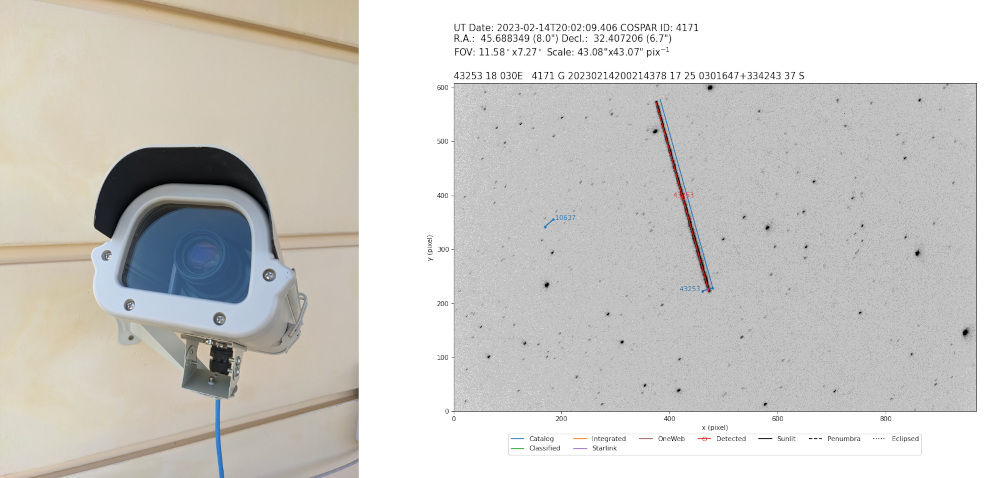

# STVID

## Introduction
STVID (satellite tools for video) is a set of applications for observing the night sky with video cameras and detecting, measuring and identifying satellites in these observations. 
 


STVID provides the following features:

-  Automatic start and end of data acquisition
- Compression of raw video frames using the maximum temporal pixel method ([Gural & Segon 2009](https://ui.adsabs.harvard.edu/abs/2009JIMO...37...28G/abstract))
- Detection of satellites in position and time using the 3D Hough transform ([Dalitz et al. 2017](https://www.ipol.im/pub/art/2017/208/))
- Fast calculation of satellite predictions using different orbital catalogs of two-line elements (TLEs)
- Matching and identification of detected satellites against predictions
- Output results in [IOD format](http://www.satobs.org/position/IODformat.html) for publishing on [SeeSat-L](http://www.satobs.org/seesat/index.html)

## Table of Contents

1. [Requirements](#requirements)
1. [Installation](#installation)
1. [Configuration](#configuration)
1. [Operation](#operation)
1. [Supported hardware](#supported-hardware)

## Requirements

- A computer desktop or single board computer like a Raspberry PI) with a linux operating system for running STVID
- An internet connection to allow time synchronization using the Network Time Protocol (NTP)
- An analog video or digital CMOS camera. Currently supported cameras are:
	- Any camera working with OpenCV
	- ZWO ASI cameras
	- Raspberry Pi HQ camera
- A fast photographic lens, F/1.8 or faster, capable of delivering a pixel scale of 30 to 60 arsec/pix
- (optional) A weather proof CCTV housing


## Installation

To install STVID, several dependencies need to be met. The following sections will detail the installation. The system wide installation commands provided here are specific for the Ubuntu 22.04 operating system, but similar software packages will be available for other operating systems.

<details>

### Dependencies

The following assumes the dependencies are installed in `$HOME/software`. Adjust this as necessary. To create this directory, run the following command.
```bash
mkdir -p $HOME/software                                  # Create directory
```

#### hough3dlines

The [hough3dlines](https://gitlab.com/pierros/hough3d-code) application is used to detect satellite trails in 3 dimensions (x and y position over time). The following commands will download, compile and install the `hough3dlines` executable in `/usr/local/bin`.
```bash
sudo apt install git make g++ libeigen3-dev              # Install dependencies
cd $HOME/software                                        # Goto directory
git clone https://gitlab.com/pierros/hough3d-code.git    # Clone repository
cd $HOME/software/hough3d-code                           # Goto directory
make                                                     # Compile application
sudo cp hough3dlines /usr/local/bin/                     # Install executable
make test                                                # Test installation (optional)
```

#### satpredict

Predictions of satellite positions, using two-line elements (TLEs), are computed using [satpredict](https://github.com/cbassa/satpredict).

```bash
sudo apt install make                                     # Install dependencies
cd $HOME/software                                        # Goto directory
git clone https://github.com/cbassa/satpredict.git       # Clone repository
cd $HOME/software/satpredict                             # Goto directory
make                                                     # Compile application
sudo make install                                        # Install executable
```

#### source-extractor

Stars are detected, and their positions and instrumental fluxes measured, using the `source-extractor` application. Depending on the operating system, this application can be known as the `source-extractor`, `sextractor` or `sex` executables. STVID expects this to be present in the path as `sextractor`, so the executable may need to be copied to the `sextractor` name. On Ubuntu 22.04 it is known as `source-extractor`.

```bash
sudo apt install source-extractor                              # Install binary
sudo cp /usr/bin/source-extractor /usr/local/bin/sextractor    # Copy executable
```

#### astrometry.net

The initial astrometric calibration of the STVID observations is performed with [astrometry.net](http://astrometry.net/). This application can be installed with the following command.

```bash
sudo apt install astrometry.net                                # Install binary
```
This application needs index files, which can be downloaded from [data.astrometry.net](http://data.astrometry.net/). For the widefield observations obtained with STVID, we need to download the 4100 series images (340MB in total). Check where the `add_path` variable in `/etc/astrometry.cfg` where the application will search for index files. Usually this is `/usr/share/astrometry`. These can be downloaded (as root) as follows.
```bash
sudo bash                                                      # Create a session with root privileges
cd /usr/share/astrometry                                       # Goto the add_path directory
wget -c http://data.astrometry.net/4100/index-4107.fits        # Download index files
wget -c http://data.astrometry.net/4100/index-4108.fits
wget -c http://data.astrometry.net/4100/index-4109.fits
wget -c http://data.astrometry.net/4100/index-4110.fits
wget -c http://data.astrometry.net/4100/index-4111.fits
wget -c http://data.astrometry.net/4100/index-4112.fits
wget -c http://data.astrometry.net/4100/index-4113.fits
wget -c http://data.astrometry.net/4100/index-4114.fits
wget -c http://data.astrometry.net/4100/index-4115.fits
wget -c http://data.astrometry.net/4100/index-4116.fits
wget -c http://data.astrometry.net/4100/index-4117.fits
wget -c http://data.astrometry.net/4100/index-4118.fits
wget -c http://data.astrometry.net/4100/index-4119.fits
exit                                                           # Exit session
```

#### ZWO ASI SDK and ASIStudio (optional)

For users that will operate ZWO ASI cameras, you will need to download and install the ZWO ASI SDK (software developers kit). Go to the ZWO ASI [software and drivers](https://astronomy-imaging-camera.com/software-drivers) page and click the *Developers* tab. Download the *Linux & Mac* SDK. This likely is called something like `ASI_linux_max_SDK_V1.28.tar.bz2`. This file can be extracted as follows (assuming the file is downloaded into the `$HOME` directory; adjust as necessary.

```bash
cd $HOME/software                                              # Goto directory
bzip2 -cd $HOME/ASI_linux_mac_SDK_V1.28.tar.bz2 | tar xvf -    # Extract archive
```

To operate and focus a ZWO ASI camera, it is recommended to install the ASIStudio software from ZWO ASI. This software will allow you to test the camera indepently from STVID and will help with pointing and focusing by giving you full interactive control of all camera properties. The installation of this software will also ensure that the ZWO ASI camera will get the necessary user permissions for it to operate with STVID.

To download ASIStudio, click the *Linux* tab at ZWO ASI [software and drivers](https://astronomy-imaging-camera.com/software-drivers) page and download the `x64` version of ASIStudio. This will likely download a file called `ASIStudio_V1.8.run`. The following commands will run the installer (assuming the file is downloaded in the `$HOME` directory).

```bash
chmod +x $HOME/ASIStudio_V1.8.run                              # Set permissions to execute installer
$HOME/ASIStudio_V1.8.run                                       # Execute installer
```
The ASIStudio installer will ask where to install the applications and to accept their license. Once installed, run the `ASICap` application with your ZWO ASI camera attached. The application will ask to you to provide the `sudo` credentials to install the `udev` rules setting the necessary user permissions. Once those are set, you should be able to operate your camera from within `ASICap`.

### STVID installation

With the dependencies installed, we can install STVID using the following commands.

```bash
sudo apt install python-is-python3 python3-pip                 # Install python3 and pip
cd $HOME/software                                              # Goto directory
git clone https:/github.com/cbassa/stvid.git                   # Clone STVID repository
cd $HOME/software/stvid                                        # Goto directory
pip install -r requirements.txt                                # Install python requirements
```

</details>	
	
## Configuration

<details>

STVID is configured through a configuration file. A boiler plate configuration file is included as `configuration.ini-dist`. Copy this file to `configuration.ini` using the following command

```bash
cp configuration.ini-dist configuration.ini          # Copy configuration file
```

Most parameters in `configuration.ini` do not need to be changed, except for the following:

#### Observer
- `cospar`: A COSPAR number if you have one, use a number between 9900 and 9999 otherwise.
- `name`, `latitude`, `longitude`, `height`: Your name and location (latitude, longitude, height) in the WGS84 coordinate frame.

#### Setup
- `camera_type`: Your camera selection (`ASI` for ZWO ASI cameras, `CV2` for opencv cameras, `PI` for the Raspberry Pi HQ camera).
- `observations_path`: Directory where you want to store the observations.

#### Credentials
It is highly recommended to use the catalog of two-line elements (TLEs) from [space-track.org](https://www.space-track.org). Use the credentials of your account to download TLEs.

#### Elements
This section describes the TLE catalog that STVID downloads and how they are used and plotted.

- `tlepath`: Directory where you want to store the TLE catalogs

#### ZWO ASI cameras
For ZWO ASI cameras you need to specify the location of the ZWO ASI SDK libraries. For `x64` operating systems this is the `lib/x64/libASICamera2.so` shared library in the directory tree where you installed the SDK.

</details>	
	
## Operation

There are three applications in STVID that work together:

- `update_tle.py` to download orbital catalogs of two-line elements (TLEs).
- `acquire.py` to capture data from your camera and store them as FITS files.
- `process.py` to analyse the FITS files and determine satellite positions.

#### Updating TLEs

Assuming you have installed STVID in `$HOME/software/stvid` and your configuration is stored in `configuration.ini`, the TLE catalogs can be updated with the following command.
```bash
$HOME/software/stvid/update_tle.py -c $HOME/software/stvid/configuration.ini
```
This will download TLE catalogs from the following sources:

1. The master catalog called `catalog.tle` from [https://www.space-track.org](https://www.space-track.org). This requires your space-track.org credentials to be provided in `configuration.ini`.
1. The classified catalog `classfd.tle` from [Mike McCants](https://www.prismnet.com/~mmccants/tles/index.html). This catalog has TLEs for classified objects not present in `catalog.tle`.
1. The integrated elements `inttles.tle` from [Mike McCants](https://www.prismnet.com/~mmccants/tles/index.html). These are numerically integrated orbits converted into TLEs for objects at high altitudes.
1. Supplemental TLEs for Starlink satellites in `starlink.tle` from [celestrak.com](https://celestrak.org/NORAD/elements/supplemental/). These are TLEs computed from orbital ephemerides shared by the satellite operators and include predicted manouvers. These TLEs tend to be more accurate than those in `catalog.tle` which are based on observations.
1. Supplemental TLEs for OneWeb satellites in `oneweb.tle` from [celestrak.com](https://celestrak.org/NORAD/elements/supplemental/). These are TLEs computed from orbital ephemerides shared by the satellite operators and include predicted manouvers. These TLEs tend to be more accurate than those in `catalog.tle` which are based on observations.
	

## Supported hardware
TBD

## Todo

<details>

Features to be implemented.

#### High priority
* ~~Use sunset/sunrise times for starting/stopping data acquisition.~~
* ~~Automatic astrometric calibration.~~
* ~~Recognize unidentified satellite/meteor tracks using [3D Hough transform](http://www.ipol.im/pub/art/2017/208/).~~

#### Medium priority
* Pause data acquisition of the current line-of-sight (alt/az) is in the Earth's shadow for a particular orbital altitude.
* Investigate sensitivity loss of `significance=(max-mean)/sigma` if the four frame images are stored as 8bit integers instead of floats.


#### Low priority
* Implement python based star finding (stick with *source extractor* for now).
* Migrate to [python based SGP4/SDP4 algorithms](https://github.com/brandon-rhodes/python-sgp4)
* Use masks to mask unilluminated CCD areas.
* Investigate automatic submission of IOD measurements to [SeeSat-L](http://www.satobs.org/seesat/).
* ~~Migrate user settings to a configuration file.~~

## Run acquisition at startup

* Add user to video group (`sudo adduser <username> video`).
* Add video device to udev rules (add `SUBSYSTEM=="video1", GROUP="video", MODE="0660"` in `/etc/udev/rules.d/10-webcam.rules`).
* Create start up script in `/etc/init.d`. Call capture script as user with `su <username> -c "acquire.py"`.

</details>	
	
## License
&copy; 2018-2023 Cees Bassa

Licensed under the [GPLv3](LICENSE).
